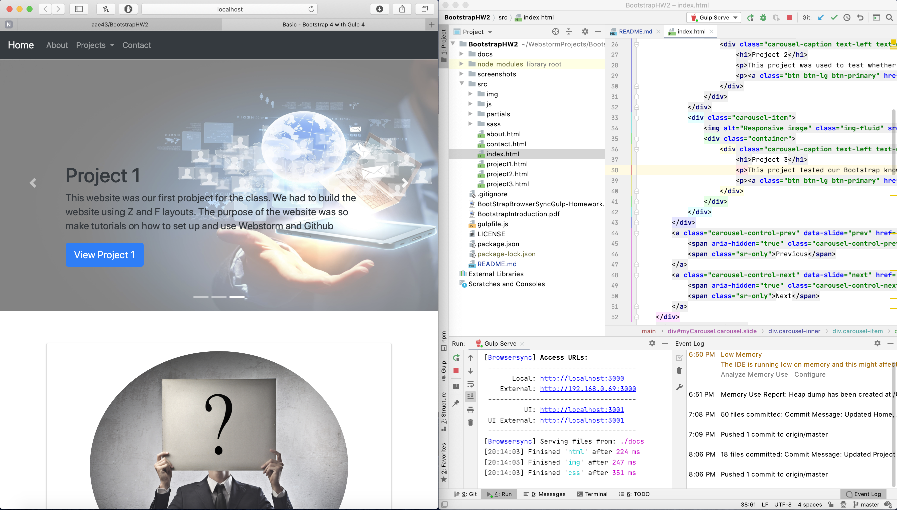

# HW 2
Bootstrap HW # 2
## Links
* [Running Project](https://aae43.github.io/BootstrapHW2/)
* [Repository Link](https://github.com/aae43/BootstrapHW2)

#  Gulp

# Readings
* [What is Bootstrap?](https://www.tutorialrepublic.com/twitter-bootstrap-tutorial/)
* [What is GULP? <- You need to follow this or it won't work](https://www.sitepoint.com/introduction-gulp-js/)
* [What is Browser Sync?](https://torquemag.io/2017/06/automate-workflow-browsersync/)
* [What is SASS CSS(SCSS)?](https://sass-lang.com/guide)
* [What are Partial Templates?](https://github.com/xkxd/gulp-html-partial)

# Useful Links
* [Bootstrap Components](https://getbootstrap.com/2.3.2/components.html)
* [Gulp Homepage](https://gulpjs.com)
* [Browser Sync Homepage](https://browsersync.io)
* [SCSS Homepage](https://sass-lang.com/guide)
* [Markdown Cheat Sheet Reference](https://github.com/adam-p/markdown-here/wiki/Markdown-Cheatsheet)